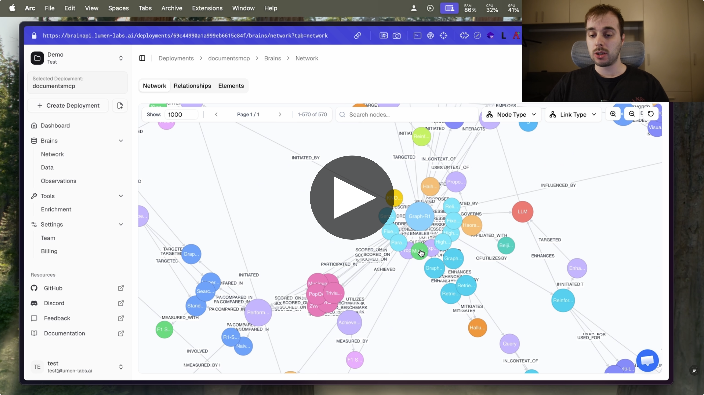

<p align="center">
  <a href="https://discord.gg/VTngQTaeDf"></a>
  
  
  
</p>

<h1 align="center">🧠 BrainAPI</h1>

<p align="center">
  <strong>Your AI doesn't have memory. It has a database. There's a difference.</strong>
  <br/><br/>
  <em>BrainAPI turns raw text, documents and events into a living knowledge graph —<br/>one that reasons, connects dots, and grows smarter with every ingestion.</em>
</p>

<p align="center">
  <!-- <a href="https://brainapi.lumen-labs.ai/docs/quickstart"></a> -->
  <a href="https://youtu.be/ECOleTRjl64?si=fBUALoYvsiUl-BPC"></a>
</p>

<p align="center">
  <a href="https://brainapi.lumen-labs.ai/">BrainAPI Cloud</a> •
  <a href="#-what-is-brainapi">Overview</a> •
  <a href="#-core-philosophy-the-triangle-of-attribution">Core Philosophy</a> •
  <a href="#-the-agentic-swarm">Agents</a> •
  <a href="https://brainapi.lumen-labs.ai/docs/v2/installation">SDKs</a> •
  <a href="https://brainapi.lumen-labs.ai/docs/v2">API Docs ↗</a>
</p>

<a href="https://youtu.be/ECOleTRjl64?si=fBUALoYvsiUl-BPC">
  
</a>

<p align="center">
  
</p>

---

## ⚡ See It in 30 Seconds

Feed BrainAPI one sentence:

```
"Emily organized the AI Ethics Meetup in London on March 8, 2024."
```

Ask it a question it was never explicitly told the answer to:

```python
result = client.retrieveContext("Who organized AI events in London in Q1 2024?")
# → "Emily organized the AI Ethics Meetup in London on 2024-03-08."
# → result.triples shows the full graph path used to derive this
```

That trace is the difference. Not a similarity score. Not a nearest-neighbour guess. A **reasoned, walkable path through a knowledge graph** — built automatically from your raw text.

> **[▶ Watch the full demo →](https://youtu.be/ECOleTRjl64?si=fBUALoYvsiUl-BPC)**

---

## 🏃 Try It Now

```sh
# Clone and run in under 2 minutes
git clone https://github.com/lumen-labs/brainapi2.git && cd brainapi2
poetry install && make start-all
```

Or with Docker (recommended):

```sh
docker compose -f example-docker-compose.yaml up -d
```

Then ingest your first data point:

```sh
curl -X POST http://localhost:3000/ingest \
  -H "Authorization: Bearer $BRAIN_API_KEY" \
  -H "Content-Type: application/json" \
  -d '{"type": "text", "content": "Emily organized the AI Ethics Meetup in London on 2024-03-08."}'
```

Full walkthrough → [Quick Start Guide](https://brainapi.lumen-labs.ai/docs/quickstart)

---

## 📖 What is BrainAPI?

BrainAPI is an advanced **knowledge graph ecosystem** designed for high-precision semantic reasoning and relational analysis across multi-domain datasets. Unlike traditional databases that store static snapshots, BrainAPI uses a dynamic **Event-Centric architecture** — treating actions, interactions and state changes as first-class nodes that capture multi-dimensional context, temporal history and complex multi-hop reasoning.

**The core idea:** raw documents, plain text and event streams go in. A queryable, time-aware knowledge graph comes out — powering long-term memory, recommendations and natural-language retrieval for AI agents without you needing to build an extraction pipeline yourself.

> **Why Event-Centric?**  
> Move beyond simple keyword retrieval toward **"Action-Path Reasoning."** BrainAPI identifies not just _that_ two entities are connected, but _how_ they interacted, at what _magnitude_, and within what _environment_.

### When to use BrainAPI

✅ **BrainAPI excels when you need:**

- Structured knowledge extracted from messy, constantly-changing data sources
- Long-term AI memory that persists across sessions, users and documents
- Explainable relationships behind recommendations — not just similarity scores
- Multi-hop queries over temporal data with traceable provenance

⚠️ **It may be overkill if:**

- Your data fits a fixed schema you fully control
- A single SQL query or simple CRUD operations solve the problem
- You need purely local, offline-only storage with zero extraction

---

## ⚙️ How It Works: The Ingestion Pipeline

Every piece of data you feed BrainAPI flows through a five-step pipeline before it becomes queryable knowledge:

```
  Raw data (files, text, APIs, event streams)
          │
          ▼
  ┌───────────────────────────────────────────────────┐
  │  1. INGEST                                        │
  │     Accept documents, plain text, structured      │
  │     events                                        │
  └──────┬────────────────────────────────────────────┘
         │
         ▼
  ┌───────────────────────────────────────────────────┐
  │  2. ANNOTATE                                      │
  │     Save observations, notes and annotations on   │
  │     the new data — informed by existing knowledge │
  │     already in the graph                          │
  └──────┬────────────────────────────────────────────┘
         │
         ▼
  ┌───────────────────────────────────────────────────┐
  │  3. PROCESS                                       │
  │                                                   │
  │  3a. EXTRACT                                      │
  │      Identify entities, events, adjectives and    │
  │      properties in the new data                   │
  │                 │                                 │
  │                 ▼                                 │
  │  3b. LINK                                         │
  │      Connect extracted nodes with relationships   │
  │      — to each other and to existing KG nodes     │
  │                 │                                 │
  │                 ▼                                 │
  │  3c. DEDUPLICATE                                  │
  │      Entity resolution — merge duplicates,        │
  │      reconcile conflicts, unify references        │
  │                 │                                 │
  │                 ▼                                 │
  │  3d. CONSOLIDATE  (optional)                      │
  │      High-level graph reasoning to inject or      │
  │      edit inferred knowledge from the current     │
  │      state of the graph                           │
  └──────┬────────────────────────────────────────────┘
         │
         ▼
  ┌───────────────────────────────────────────────────┐
  │  4. STORE                                         │
  │     Persist as a connected, time-aware graph      │
  └──────┬────────────────────────────────────────────┘
         │
         ▼
  ┌───────────────────────────────────────────────────┐
  │  5. QUERY                                         │
  │     REST · Python SDK · Node SDK · MCP            │
  └───────────────────────────────────────────────────┘
```

You bring the data. BrainAPI handles the rest — no custom extraction pipeline required.

---

## 🔺 Core Philosophy: The Triangle of Attribution

Every action in the graph is modeled as a central **Event Hub** connecting three critical points through directed energy vectors:

```
                    ┌─────────────────┐
                    │   EVENT HUB     │
                    │  (Action Node)  │
                    └────────┬────────┘
                             │
           ┌─────────────────┼─────────────────┐
           │                 │                 │
           ▼                 ▼                 ▼
    ┌──────────────┐  ┌──────────────┐  ┌──────────────┐
    │    ACTOR     │  │    TARGET    │  │   CONTEXT    │
    │   (Source)   │  │ (Recipient)  │  │  (Anchor)    │
    └──────────────┘  └──────────────┘  └──────────────┘
         :MADE            :TARGETED       :OCCURRED_WITHIN
```

| Vector         | Relationship                 | Description                                                                       |
| -------------- | ---------------------------- | --------------------------------------------------------------------------------- |
| **Initiation** | `:MADE` / `:INITIATED`       | Connects the **Actor** to the **Event Hub**. Carries quantitative `amount` data.  |
| **Targeting**  | `:TARGETED` / `:DIRECTED_AT` | Connects the **Event Hub** to the **Target** (recipient/destination).             |
| **Context**    | `:OCCURRED_WITHIN`           | Connects the **Event Hub** to a **Persistent Anchor** (org, location, timeframe). |

This model is what enables BrainAPI to answer questions like _"Who organized AI events in London in March 2024?"_ and return a traceable graph path — not just a similarity score.

---

## 🤖 The Agentic Swarm

BrainAPI transforms unstructured text into rigorous graph schemas through a specialized **multi-agent ingestion pipeline**. Each agent has a single, clearly-defined responsibility:

| Agent               | Role                  | Responsibility                                                                       |
| :------------------ | :-------------------- | :----------------------------------------------------------------------------------- |
| 🔍 **Scout**        | Semantic Fact-Finding | Identifies raw entities; distinguishes static properties from dynamic shared anchors |
| 🏛️ **Architect**    | Structural Mapping    | Translates facts into the Triangle of Attribution, enforcing vector directionality   |
| 🧹 **Janitor**      | Directional Police    | Audits graph units, resolves UUIDs, flips inverted relationships violating ontology  |
| 🔄 **Consolidator** | Micro-Swarm Auditor   | Performs deduplication and hub merging via collaborative voting (MAKGED)             |

This modular design keeps ingestion reliable while maintaining a consistent, conflict-free graph over time. Because each agent has a narrow role, failures are isolated and the pipeline stays auditable end-to-end.

---

## 🔎 Retrieval & Intelligence Layer

<details>
<summary><strong>KGLA — Knowledge Graph Enhanced Language Agents</strong></summary>

Bridges structured facts and natural language. Extracts multi-hop paths and translates them into human-readable explanations using rich `description` properties stored in nodes and relationships.

</details>

<details>
<summary><strong>RGP — Relational Graph Perceiver with Temporal Sampling</strong></summary>

Applies **Temporal Subgraph Sampling** to prioritize contextually recent events while enabling "Non-Local Temporal Matching" — finding entities that shared similar challenges during the same chronological windows.

</details>

<details>
<summary><strong>HippoRAG2 — Subgraph Localization</strong></summary>

Uses **Personalized PageRank** to navigate large, disparate data clusters. By traversing abstract "Concept Nodes," bridges disconnected subgraphs to discover structurally distant but semantically related information.

</details>

<details>
<summary><strong>Quantitative Synergy Scoring</strong></summary>

Ranks results using a multi-factor formula balancing semantic similarity, temporal recency and quantitative alignment:

$$Score = (Similarity \times W_1) + (Recency \times W_2) + (PropertyAlignment)$$

Retrieval is based not just on _what_ an entity is, but on the _scale_ and _timing_ of their recorded actions.

</details>

---

## 🚀 Use Cases

### 1. AI Memory for Agents & Apps

Equip your agents and applications with persistent, structured memory — enabling nuanced contextual understanding, continuity across sessions and knowledge grounding over long time horizons.

**Example input sequence:**

1. `"The user's favorite tool is VSCode."`
2. `"She also uses GitHub Copilot for code suggestions."`

**Constructed graph:**

```
(User)-[:MADE]->(Preference Event)-[:TARGETED]->(VSCode)
(User)-[:MADE]->(Usage Event)-[:TARGETED]->(GitHub Copilot)
                                  \
                                   \-[:OCCURRED_WITHIN]->(Code Suggestions)
```

**Queries this unlocks:**

- _"Which productivity tools does the user rely on for coding?"_
- _"Recommend AI tools that integrate with VSCode."_

---

### 2. Relationship-Driven Recommendation Systems

Leverage BrainAPI's graph of actions, relationships and temporal contexts to produce precise recommendations — for content, products, collaborators or actions — grounded in real behavioural paths rather than click co-occurrence.

**Example input:** `"Alice bought 'Neural Networks 101' during the Spring AI Symposium."`

**Constructed graph:**

```
(Alice)-[:MADE {date: "2024-04-12"}]->(Purchase Event)-[:TARGETED]->(Neural Networks 101)
                                      \
                                       \-[:OCCURRED_WITHIN]->(Spring AI Symposium)
```

**Recommendation unlocked:**  
_Bob also attended the Spring AI Symposium — he may be interested in the same books as Alice._

---

### 3. Semantic Knowledge Search

Move beyond keyword search and retrieve information via deep semantic connections, matching intent, events and multi-hop reasoning across documents, tickets and chat history.

**Example input:** `"Tesla presented their latest battery at the 2023 Battery Expo in Berlin."`

**Constructed graph:**

```
(Tesla)-[:MADE]->(Presentation Event)-[:TARGETED]->(Latest Battery)
                                    \
                                     \-[:OCCURRED_WITHIN]->(2023 Battery Expo)-[:HELD_IN]->(Berlin)
```

**Query:** `"What products did Tesla present in Berlin in 2023?"`  
**Result:** `"The latest battery was presented at the 2023 Battery Expo in Berlin."`

---

### 4. Community & Expert Mapping

Identify domain experts, map collaboration paths and surface emerging topics within an organization or community. Answer questions like _"Who in our org has worked on Kubernetes and ML pipelines together?"_

### 5. Business Intelligence from Qualitative Data

Feed in customer feedback, usage events and support conversations. BrainAPI extracts patterns, sentiment signals and recurring themes — turning free-form qualitative data into structured, queryable business intelligence.

### 6. Investigation & Compliance Workflows

Connect people, events, documents and timestamps into a coherent investigative graph. Ideal for compliance teams, journalists and researchers who need to trace relationships across large, heterogeneous source corpora.

---

### End-to-End Example: From Text to Graph to Answer

**Step 1 — Ingest**

```json
{
  "actor": "Emily",
  "event": "organized",
  "target": "AI Ethics Meetup",
  "context": "London",
  "date": "2024-03-08"
}
```

**Step 2 — Graph representation**

```
(Emily)-[:MADE {date: "2024-03-08"}]->(Organizing Event)-[:TARGETED]->(AI Ethics Meetup)
                                        \
                                         \-[:OCCURRED_WITHIN]->(London)
```

**Step 3 — Retrieve**

- Query: `"Who organized AI events in London in March 2024?"`
- Result: `"Emily organized the 'AI Ethics Meetup' in London on 2024-03-08."`

**Step 4 — Recommend**

- Query: `"What other events has Emily organized, or what similar events are happening in London?"`
- Result: Past and upcoming meetups in London, related organizers, AI-themed events.

---

## 🔌 Connecting Claude Desktop via MCP

The MCP server runs as a separate process on port **8001** (`http://localhost:8001/mcp`) to avoid ASGI nesting issues.

1. Start the MCP server: `make start-mcp` — keep it running.
2. Open Claude Desktop → **Settings → Developer → Edit Config** (`claude_desktop_config.json`).
3. Add the following under `mcpServers`:

```json
"brainapi-local": {
  "command": "/path/to/your/node/version/v22.19.0/bin/npx",
  "args": ["-y", "@pyroprompts/mcp-stdio-to-streamable-http-adapter"],
  "env": {
    "URI": "http://localhost:8001/mcp",
    "MCP_NAME": "brainapi-local",
    "PATH": "/path/to/your/node/version/v22.19.0/bin:/usr/local/bin:/usr/bin:/bin",
    "BEARER_TOKEN": "your-pat-here"
  }
}
```

4. Ensure URL-based MCP servers are enabled in Claude Desktop settings.

---

## 📦 SDKs & Packages

Integrate BrainAPI into your stack using our official client libraries:

| Platform    | Package                                                               | Status                                                                                    |
| ----------- | --------------------------------------------------------------------- | ----------------------------------------------------------------------------------------- |
| **Python**  | [`lumen_brain`](https://pypi.org/project/lumen_brain/)                |  ⚠️ Pre-release |
| **Node.js** | [`lumen-brain`](https://www.npmjs.com/package/@lumenlabs/lumen-brain) |  ⚠️ Pre-release   |

> **Note:** Both SDKs are at version 0.x and under active development. For production use cases, we recommend the [REST API](https://brainapi.lumen-labs.ai/docs/rest) directly until v1.0 releases.

You can mix interaction modes freely — for example, ingest data via REST on a schedule and retrieve context via MCP for agent runtimes.

---

## 🧩 Plugin Registry & Extensibility

BrainAPI is designed to be extended without forking the core. Teams can publish and install plugins through the **BrainAPI CLI** to modify ontology, add custom routes, tune agent prompts, or register new MCP tools.

### Install a plugin

```sh
brainapi plugins install @community/crm-entities
brainapi plugins list
```

### Publish your own

```sh
brainapi plugins login          # authenticate as a publisher
brainapi plugins publish ./my-plugin
brainapi plugins depublish @myorg/my-plugin@1.0.0
```

Plugins can:

- Extend the graph ontology with new entity and relation types
- Add custom REST routes to the BrainAPI server
- Customize agent prompts for domain-specific extraction
- Register new MCP tools for agent runtimes

Browse and publish at the [Plugin Registry →](https://registry.brain-api.dev/app)

---

## 💻 SDK Quick Examples

You can mix interaction modes freely — ingest over REST on a schedule, retrieve via MCP inside an agent runtime, or use the SDKs for everything.

**Ingest via REST:**

```sh
curl -X POST https://localhost:3000/ingest \
  -H "Authorization: Bearer $BRAIN_API_KEY" \
  -H "Content-Type: application/json" \
  -d '{"type": "text", "content": "Emily organized the AI Ethics Meetup in London on 2024-03-08."}'
```

**Ingest & query with the Python SDK:**

```python
from lumen_brain import BrainAPI

client = BrainAPI(api_key="your-key")

# Ingest
client.ingest.text("Emily organized the AI Ethics Meetup in London on 2024-03-08.")

# Query
result = client.query("Who organized AI events in London in March 2024?")
print(result.answer)   # "Emily organized the AI Ethics Meetup on 2024-03-08."
print(result.trace)    # Full graph path used to derive the answer
```

**Ingest with the Node.js SDK:**

```typescript
import { BrainAPI } from "@lumenlabs/lumen-brain";

const client = new BrainAPI({ apiKey: process.env.BRAIN_API_KEY });
await client.ingest.text(
  "Emily organized the AI Ethics Meetup in London on 2024-03-08."
);
const result = await client.query(
  "Who organized AI events in London in March 2024?"
);
console.log(result.answer);
```

---

## ⚖️ BrainAPI vs. Memory Vaults

> **Other tools store your words. BrainAPI builds understanding.**

Most AI memory tools store conversation transcripts verbatim. No extraction, no reasoning, no connections. Just text in, text out, closest match returned. That's a search engine dressed up as memory.

BrainAPI extracts _what happened, who was involved, when, and how it connects to everything else_ — then stores that as a traversable, time-aware graph. The result isn't a retrieved chunk. It's a reasoned answer with a provenance trail.

|                   | BrainAPI                                   | Memory Vault (e.g. MemPalace)      |
| ----------------- | ------------------------------------------ | ---------------------------------- |
| **Storage model** | Structured knowledge graph                 | Verbatim transcripts               |
| **Extraction**    | Multi-agent pipeline                       | None — stores raw text             |
| **Reasoning**     | Multi-hop, time-aware queries              | Semantic similarity search         |
| **Answers**       | Traceable graph paths                      | Nearest-neighbour scores           |
| **Grows smarter** | ✅ Yes — each ingestion enriches the graph | ❌ No — each doc sits in isolation |
| **Deployment**    | Cloud or self-hosted                       | Local only                         |

If you just need to find a sentence you wrote before, use a memory vault. If you need your system to _understand_ what happened and _why it matters_ — use BrainAPI.

---

<p align="center">
  <a href="https://www.youtube.com/watch?v=wWwTFU5-qeA">
    
    <br/>
    <strong>▶ Watch: BrainAPI (non-technical) Overview Video</strong>
  </a>
</p>

---

## 📚 Resources

| Resource               | Link                                                                                             |
| ---------------------- | ------------------------------------------------------------------------------------------------ |
| 📖 Documentation       | [brainapi.lumen-labs.ai/docs/v2](https://brainapi.lumen-labs.ai/docs/v2)                         |
| ⚡ Quick Start Guide   | [brainapi.lumen-labs.ai/docs/quickstart](https://brainapi.lumen-labs.ai/docs/quickstart)         |
| 🔌 Plugin Registry     | [registry.brain-api.dev/app](https://registry.brain-api.dev/app)                                 |
| 🛠️ REST API Reference  | [brainapi.lumen-labs.ai/docs/rest](https://brainapi.lumen-labs.ai/docs/rest)                     |
| 🐍 Python SDK (PyPI)   | [pypi.org/project/lumen_brain](https://pypi.org/project/lumen_brain/)                            |
| 📦 Node.js SDK (npm)   | [npmjs.com/package/@lumenlabs/lumen-brain](https://www.npmjs.com/package/@lumenlabs/lumen-brain) |
| 💬 Community & Support | [Discord](https://discord.gg/VTngQTaeDf)                                                         |

---

> BrainAPI isn't memory. It's understanding at scale — queryable, explainable, and built to grow.  
> **[Start building →](https://brainapi.lumen-labs.ai/docs/quickstart)**

---

## 🤝 Contributing

1. Fork the repository
2. Create a feature branch (`git checkout -b feature/amazing-feature`)
3. Commit your changes (`git commit -m 'Add amazing feature'`)
4. Push to the branch (`git push origin feature/amazing-feature`)
5. Open a Pull Request

---

## 📄 License

This project is licensed under **AGPLv3 + Commons Clause** — free for personal, research and non-commercial use. Commercial usage (SaaS, embedding, redistribution) requires an [Enterprise License](mailto:hello@lumen-labs.ai) from Lumen Platforms Inc.

See the [LICENSE](LICENSE) file for full details.

---

<p align="center">
  <sub>Built with ❤️ by <a href="https://github.com/lumen-labs">Lumen Labs</a></sub>
</p>
