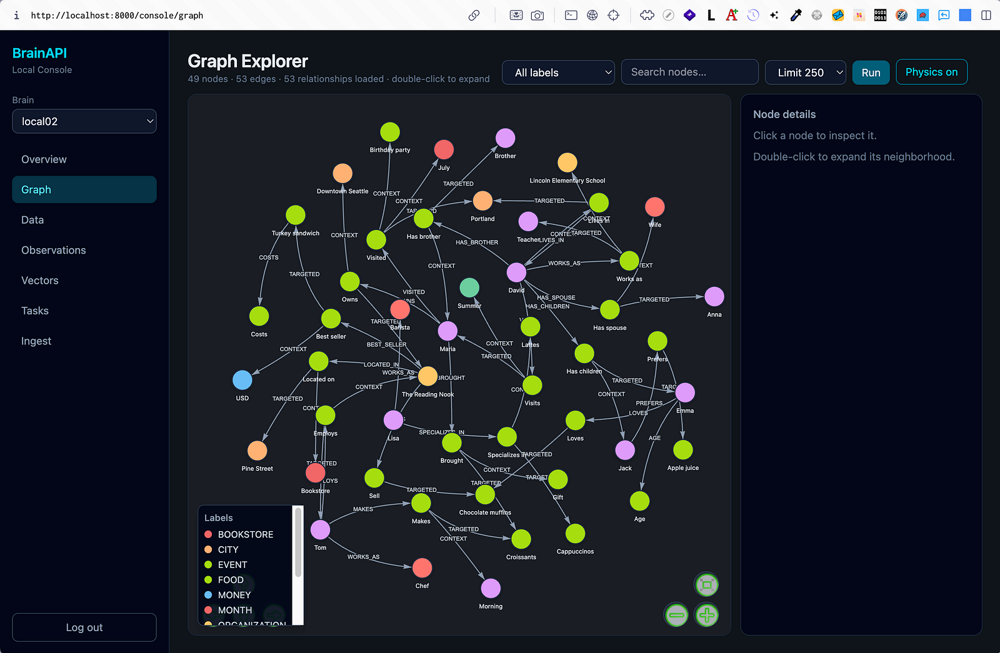
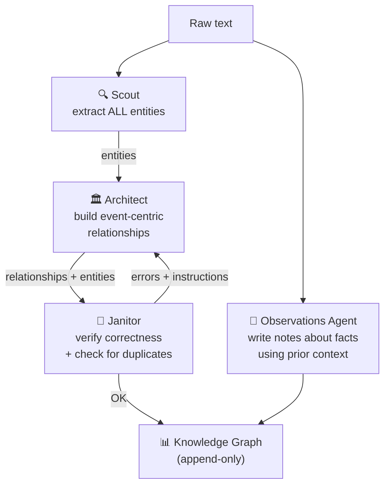

<p align="center">
  <a href="https://discord.gg/VTngQTaeDf"></a>
  
  
  
</p>

<h1 align="center">🧠 BrainAPI</h1>

<p align="center">
  <strong>Turn raw text into a living knowledge graph — automatically.</strong>
  <br/><br/>
  <em>You send text. A swarm of agents reads it, takes notes, and draws the graph for you.<br/>
  Then you ask questions and get answers backed by a traceable path — not a similarity guess.</em>
</p>

<p align="center">
  <a href="https://brainapi.lumen-labs.ai/">BrainAPI Cloud</a> •
  <a href="#-quickstart-fastest-way-to-run-it">Quickstart</a> •
  <a href="#-what-is-brainapi">What it is</a> •
  <a href="#️-how-it-works-the-agent-swarm">How it works</a> •
  <a href="#-where-you-can-use-it">Use cases</a> •
  <a href="https://brainapi.lumen-labs.ai/docs/v2">Docs ↗</a>
</p>

<a href="https://youtu.be/ECOleTRjl64?si=fBUALoYvsiUl-BPC">
  
</a>

<p align="center">
  
</p>

---

## 📖 What is BrainAPI?

**BrainAPI reads your text and builds a knowledge graph out of it — by itself.**

You feed it documents, notes, messages or events. Behind the scenes a group of AI agents reads everything, understands what happened, writes down the facts, and connects them into a queryable graph. You then ask questions in plain language and get answers grounded in the actual connections it found.

The trick is that BrainAPI is **event-centric**. Instead of just storing "A is related to B," it captures _who did what, to whom, when, and in what context_. That's what lets it answer multi-step questions and always show you the path it used to get there.

Feed it one sentence:

```
"Emily organized the AI Ethics Meetup in London on March 8, 2024."
```

Ask something it was never explicitly told:

```python
result = client.retrieveContext("Who organized AI events in London in Q1 2024?")
# → "Emily organized the AI Ethics Meetup in London on 2024-03-08."
# → result.triples shows the full graph path used to derive this
```

That trace is the difference. Not a nearest-neighbour guess — a **reasoned, walkable path through a graph it built for you.**

> **[▶ Watch the full demo →](https://youtu.be/ECOleTRjl64?si=fBUALoYvsiUl-BPC)**

---

## 🏃 Quickstart (fastest way to run it)

The quickest way to get BrainAPI running is the **`brainapi` TUI** — an interactive CLI that clones the project, sets up a Python environment, walks you through configuration, starts the backing services, and launches everything for you. Pick the defaults and you'll be up in a few minutes.

```sh
npm install -g brainapi-tui
brainapi init     # clone, install deps, interactive setup → choose "Use default settings"
brainapi start    # backing services + API + MCP + worker + console
```

When it's up:

- **API** → `http://localhost:8000`
- **Console (web UI)** → `http://localhost:8000/console`
- **MCP server** → `http://localhost:8001/mcp`

Log in to the console with the `BRAINPAT_TOKEN` generated during setup. That's it — you have a working brain.

### TUI commands

| Command           | What it does                                                                                |
| ----------------- | ------------------------------------------------------------------------------------------- |
| `brainapi init`   | Clone the repo into `~/.brainapi/source/`, create a venv, run the setup wizard              |
| `brainapi start`  | Bring up backing services and run the API, MCP server, and Celery worker (Ctrl-C stops all) |
| `brainapi config` | Re-open the setup wizard to change one area (databases, models, pipeline, plugins, …)       |
| `brainapi doctor` | Check Python, Docker, Ollama, cloud credentials, and configured services                    |
| `brainapi update` | `git pull` the install and reinstall Python dependencies                                    |

Running any command (except `help`) before `init` will run `init` first automatically.

**Useful `brainapi start` flags:** `--pipeline accurate|lightweight`, `--no-services`, `--no-api` / `--no-mcp` / `--no-worker`, `--only api,mcp,worker`. Full reference → [`tui/README.md`](tui/README.md).

> The TUI installs into `~/.brainapi/` (source, venv, `.env`, and `state.json`) — separate from any git clone. Override with `BRAINAPI_HOME`, `BRAINAPI_REPO_URL`, or `BRAINAPI_BRANCH`.

---

## 🛠️ Run it locally (dev mode)

If you're contributing or hacking on BrainAPI, run it straight from the repo with `make`:

```sh
git clone https://github.com/lumen-labs/brainapi2.git && cd brainapi2
poetry install
make start-all      # backing services + API (:8000) + MCP (:8001) + Celery worker
```

`make start-all` runs everything from source with hot reload enabled, so code changes are picked up live.

**Console in dev mode:**

```sh
make build-console && make start-api   # serve console at http://localhost:8000/console
# — or hot-reload the console UI separately —
make start-api          # terminal 1
make start-console-dev  # terminal 2 → http://localhost:5173/console/
```

**Other handy targets:** `make start-api`, `make start-mcp`, `make stop-all`, and `make install-extras` (auto-installs heavy ML extras like local OCR based on your `.env`).

**Docker only:**

```sh
docker compose -f example-docker-compose.yaml up -d
```

Then ingest your first data point:

```sh
curl -X POST http://localhost:8000/ingest/ \
  -H "Authorization: Bearer $BRAINPAT_TOKEN" \
  -H "Content-Type: application/json" \
  -d '{"data": {"data_type": "text", "text_data": "Emily organized the AI Ethics Meetup in London on 2024-03-08."}, "brain_id": "default"}'
```

---

## 🖥️ The Console

The Console is a web UI for exploring everything inside your brain: the **graph**, **text chunks**, **vectors**, **observations**, **tasks**, and an **ingest** page to push new data. It's served on the same port as the API at `http://localhost:8000/console` and you log in with your `BRAINPAT_TOKEN`.

<p align="center">
  
</p>

> Set `CONSOLE_ENABLED=false` to disable static serving in environments where you don't want the UI exposed.

---

## ⚙️ How It Works: The Agent Swarm

Every piece of text you send is read and discussed by a **swarm of specialized agents**. After they understand it, they write down notes and draw the graph. Each agent has one narrow job, which keeps the pipeline reliable and auditable end to end.



1. **🔍 Scout** reads the text and extracts **all** the entities it contains — people, things, events, quantities.
2. **📝 Observations Agent** runs alongside and writes down notes about the facts in the text, taking the previously known context into account.
3. **🏛️ Architect** takes the Scout's entities, re-reads the text, and creates the connections between them as **event-centric relationships** — `subject —rel→ event —rel→ object`. Actions become first-class event hubs rather than flat edges.
4. **🧹 Janitor** checks the Architect's work: are the relationships correct, and do similar nodes (the same entity) or triplets (the same fact) already exist in the graph? If something is wrong, the Janitor tells the Architect exactly what to fix and expects a corrected output, then checks again — looping until it's clean.

### The Triangle of Attribution

Every action is modeled as a central **Event Hub** connecting three points, which is what makes multi-hop, traceable answers possible:

```
                    ┌─────────────────┐
                    │   EVENT HUB     │
                    │  (Action Node)  │
                    └────────┬────────┘
                             │
           ┌─────────────────┼─────────────────┐
           ▼                 ▼                 ▼
    ┌──────────────┐  ┌──────────────┐  ┌──────────────┐
    │    ACTOR     │  │    TARGET    │  │   CONTEXT    │
    │   (Source)   │  │ (Recipient)  │  │  (Anchor)    │
    └──────────────┘  └──────────────┘  └──────────────┘
         :MADE            :TARGETED       :OCCURRED_WITHIN
```

So `"Emily organized the AI Ethics Meetup in London"` becomes:

```
(Emily)-[:MADE]->(Organizing Event)-[:TARGETED]->(AI Ethics Meetup)
                                     \-[:OCCURRED_WITHIN]->(London)
```

### Append-only by design

BrainAPI follows an **append-only philosophy**: nothing is deleted from the graph. Every new action is appended as its own event node rather than overwriting what was already there. This keeps the full history intact and lets you **reconstruct how facts evolved over time** — events are never merged away, so the provenance trail always survives.

### Two pipeline modes

- **`accurate`** (default) — the full swarm runs: Scout extracts every entity, the Observations agent writes notes, and the Janitor validates and deduplicates the Architect's relationships.
- **`lightweight`** — a faster, cheaper path that extracts only the most important entities and skips the heavier validation steps. Switch with `--pipeline lightweight` or `PIPELINE_MODE` in `.env`.

---

## 🔎 Retrieving Knowledge

Once your data is in, BrainAPI exposes purpose-built retrieval endpoints (REST, on port `8000`):

| Endpoint                     | Method | What you get                                                                                                     |
| ---------------------------- | ------ | ---------------------------------------------------------------------------------------------------------------- |
| `/retrieve/context`          | `POST` | **Relevant information for a piece of text** — the matching graph triples plus historical context                |
| `/retrieve/entity/status`    | `GET`  | **Existence check** for a specific entity — returns whether it exists, its node, relationships, and observations |
| `/retrieve/entity/synergies` | `GET`  | **Similar things** related to a given one — effectively a recommendation algorithm over the graph                |

**Get context for a question:**

```sh
curl -X POST http://localhost:8000/retrieve/context \
  -H "Authorization: Bearer $BRAINPAT_TOKEN" \
  -H "Content-Type: application/json" \
  -d '{"text": "Who organized AI events in London in March 2024?", "brain_id": "default"}'
# → text_context + triples (the graph path) + historical_context
```

**Check if an entity exists:**

```sh
curl "http://localhost:8000/retrieve/entity/status?target=Emily" \
  -H "Authorization: Bearer $BRAINPAT_TOKEN"
# → { "exists": true, "node": {...}, "relationships": [...], "observations": [...] }
```

**Find synergies (recommendations):**

```sh
curl "http://localhost:8000/retrieve/entity/synergies?target=Neural%20Networks%20101" \
  -H "Authorization: Bearer $BRAINPAT_TOKEN"
# → similar entities ranked by how strongly they connect to the target
```

These three cover the most common needs, but there are more (`/retrieve/hops`, `/retrieve/entities/neighbors`, `/retrieve/text-chunks`, …). Full list → [REST API Reference](https://brainapi.lumen-labs.ai/docs/rest).

---

## 🧩 Plugins: Make BrainAPI Fit Your Use Case

Out of the box BrainAPI is a general-purpose understanding engine. **Plugins** let you reshape it into something far more specific — without forking the core. Because plugins can add routes, swap agent prompts, and register MCP tools, the same engine can become:

- **A cheap semantic search engine** — extract entities once, then serve fast graph-backed search instead of paying for vector queries every time.
- **A recommendation system** — build on `/retrieve/entity/synergies` and custom routes to surface related products, content or collaborators.
- **A domain-specific extractor** — override the Scout/Architect prompts so the swarm understands your ontology (CRM, legal, medical, …).
- **An agent toolset** — register custom MCP tools so any LLM runtime can read and write your brain.

A plugin can:

- Add custom REST routes to the BrainAPI server
- Override or extend the agents' prompts for domain-specific extraction
- Register new MCP tools for agent runtimes
- Ship its own background (Celery) tasks

### Install & publish

```sh
poetry run brainapi install @community/crm-entities
poetry run brainapi list --remote

poetry run brainapi register                 # become a publisher
poetry run brainapi publish ./my-plugin.tar.gz
```

Browse and publish at the [Plugin Registry →](https://registry.brain-api.dev/app)

---

## 🚀 Where You Can Use It

BrainAPI shines wherever messy, ever-changing text needs to become structured, queryable understanding:

- **AI memory for agents** — persistent, structured memory across sessions and documents, with provenance.
- **Recommendation systems** — grounded in real behavioural paths, not click co-occurrence.
- **Semantic search** — retrieve by meaning and multi-hop reasoning across docs, tickets and chat.
- **Expert & community mapping** — "Who in our org has worked on Kubernetes and ML pipelines together?"
- **Business intelligence from qualitative data** — turn feedback and support conversations into queryable signals.
- **Investigation & compliance** — connect people, events, documents and timestamps into a coherent, traceable graph.

✅ **Reach for BrainAPI when** you need structured knowledge from messy sources, long-term explainable memory, or multi-hop queries with a traceable answer.

⚠️ **Skip it when** your data already fits a fixed schema you control, or a single SQL query solves the problem.

---

## 🔌 Connecting Claude Desktop via MCP

The MCP server runs as a separate process on port **8001** (`http://localhost:8001/mcp`).

1. Start it: `make start-mcp` (or it's already running via `brainapi start`).
2. In Claude Desktop → **Settings → Developer → Edit Config**, add:

```json
"brainapi-local": {
  "command": "/path/to/node/bin/npx",
  "args": ["-y", "@pyroprompts/mcp-stdio-to-streamable-http-adapter"],
  "env": {
    "URI": "http://localhost:8001/mcp",
    "MCP_NAME": "brainapi-local",
    "PATH": "/path/to/node/bin:/usr/local/bin:/usr/bin:/bin",
    "BEARER_TOKEN": "your-pat-here"
  }
}
```

3. Make sure URL-based MCP servers are enabled in Claude Desktop settings.

---

## 📦 SDKs

| Platform    | Package                                                               | Status                                                                                    |
| ----------- | --------------------------------------------------------------------- | ----------------------------------------------------------------------------------------- |
| **Python**  | [`lumen_brain`](https://pypi.org/project/lumen_brain/)                |  ⚠️ Pre-release |
| **Node.js** | [`lumen-brain`](https://www.npmjs.com/package/@lumenlabs/lumen-brain) |  ⚠️ Pre-release   |

```python
from lumen_brain import BrainAPI

client = BrainAPI(api_key="your-key")
client.ingest.text("Emily organized the AI Ethics Meetup in London on 2024-03-08.")

result = client.retrieveContext("Who organized AI events in London in March 2024?")
print(result.text_context)   # the answer
print(result.triples)        # the graph path used to derive it
```

> Both SDKs are pre-1.0 and under active development. For production, use the [REST API](https://brainapi.lumen-labs.ai/docs/rest) directly until v1.0 ships. You can mix modes freely — ingest over REST, retrieve via MCP inside an agent runtime, or use the SDKs for everything.

---

<p align="center">
  <a href="https://www.youtube.com/watch?v=wWwTFU5-qeA">
    
    <br/>
    <strong>▶ Watch: BrainAPI (non-technical) Overview Video</strong>
  </a>
</p>

---

## 📚 Resources

| Resource               | Link                                                                                             |
| ---------------------- | ------------------------------------------------------------------------------------------------ |
| 🖥️ Local CLI (TUI)     | [`tui/README.md`](tui/README.md) — `npm install -g brainapi-tui`                                 |
| 📖 Documentation       | [brainapi.lumen-labs.ai/docs/v2](https://brainapi.lumen-labs.ai/docs/v2)                         |
| ⚡ Quick Start Guide   | [brainapi.lumen-labs.ai/docs/quickstart](https://brainapi.lumen-labs.ai/docs/quickstart)         |
| 🔌 Plugin Registry     | [registry.brain-api.dev/app](https://registry.brain-api.dev/app)                                 |
| 🛠️ REST API Reference  | [brainapi.lumen-labs.ai/docs/rest](https://brainapi.lumen-labs.ai/docs/rest)                     |
| 🐍 Python SDK (PyPI)   | [pypi.org/project/lumen_brain](https://pypi.org/project/lumen_brain/)                            |
| 📦 Node.js SDK (npm)   | [npmjs.com/package/@lumenlabs/lumen-brain](https://www.npmjs.com/package/@lumenlabs/lumen-brain) |
| 💬 Community & Support | [Discord](https://discord.gg/VTngQTaeDf)                                                         |

---

## 🤝 Contributing

1. Fork the repository
2. Create a feature branch (`git checkout -b feature/amazing-feature`)
3. Commit your changes (`git commit -m 'Add amazing feature'`)
4. Push to the branch (`git push origin feature/amazing-feature`)
5. Open a Pull Request

---

## 📄 License

This project is licensed under **AGPLv3 + Commons Clause** — free for personal, research and non-commercial use. Commercial usage (SaaS, embedding, redistribution) requires an [Enterprise License](mailto:hello@lumen-labs.ai) from Lumen Platforms Inc.

See the [LICENSE](LICENSE) file for full details.

---

<p align="center">
  <sub>Built with ❤️ by <a href="https://github.com/lumen-labs">Lumen Labs</a></sub>
</p>
